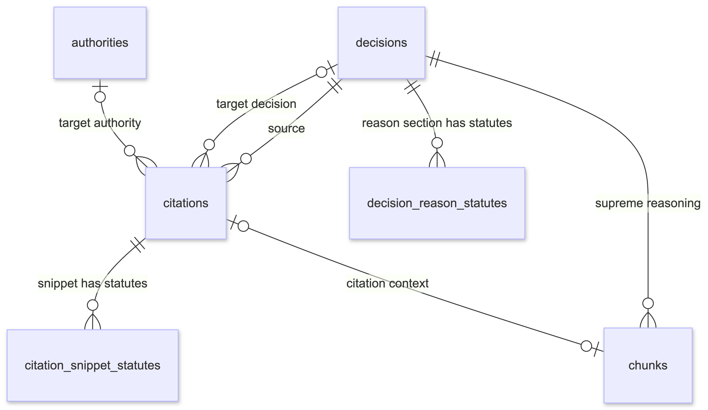
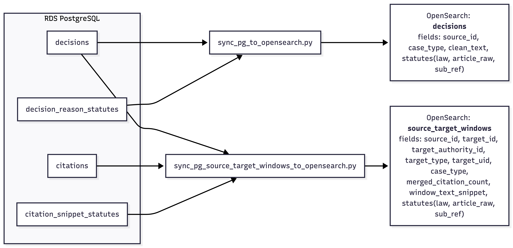
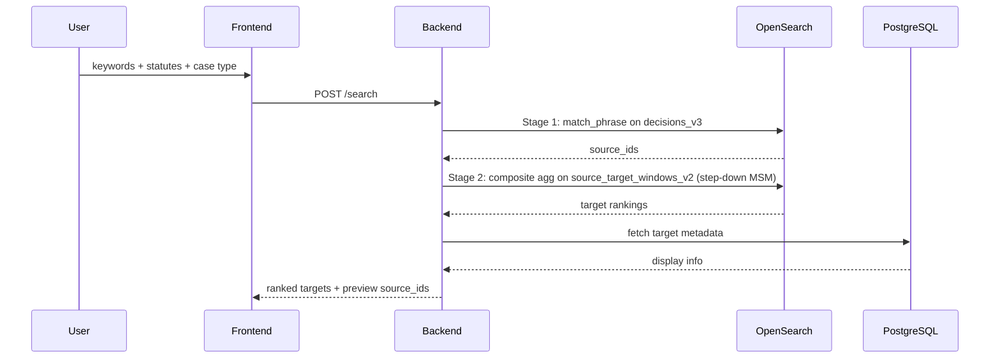
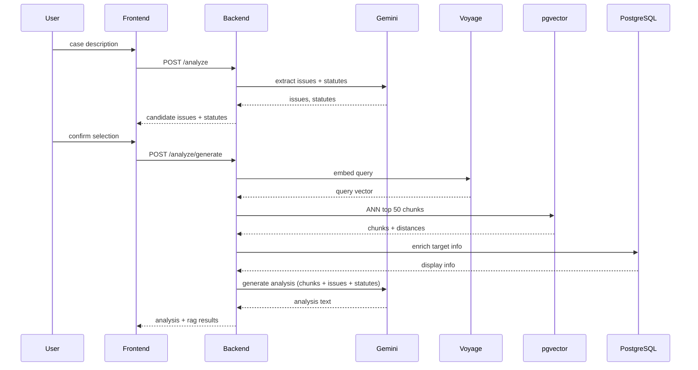

# Lawcidity

**PageRank for Taiwan court decisions.** A citation-based search engine that surfaces the precedents courts actually rely on — not just documents that mention the search terms — with keyword (OpenSearch) and semantic search (RAG) modes.

**🔗 [Demo Page](https://lawcidity.rachel-create.com/)**

> Try these searches:
> - **Keyword search**: keyword「殺人」(homicide)「無罪」(not guilty) ＋ statute「刑法」(Criminal Code)「271」
> - **RAG search**: 「如果我騎車，對方碰瓷，但沒有行車記錄器，該怎麼主張無過失？」
>   *(If I'm riding a scooter and the other party stages a collision, but I have no dashcam, how do I argue I wasn't at fault?)*

## What You Get

**Keyword search**
- Input: keyword(s) + optional statute + case type
- Output: ranked list of precedents (targets) by citation count — expand any precedent to see how source decisions quote it (snippets), then drill into a source decision's full text.

**Semantic search (RAG)**
- Input: natural language description of a legal situation
- Output: Gemini-extracted issues and statutes → AI-generated analysis per issue, with decisions ranked by semantic similarity to citation-anchored chunks.

## TL;DR

- **Problem**: Traditional legal search has two blind spots:
  1. **Positional blindness** — full-text search checks whether a keyword appears *anywhere* in the document, but ignores *where*. In court decisions, different sections carry different weight (court's own reasoning > party's arguments). Full-text search treats them equally.
  2. **Lexical gap** — the same legal concept can be phrased in many ways. If the lawyer doesn't pick the exact keyword the court used, relevant decisions are missed.

- **Approach**:
  1. **Citation-based ranking** — use citations as importance signals: extract what each decision (source) cites (targets) and the surrounding text (snippets), then rank by citation frequency (73s → 2–4s).
  2. **RAG-based semantic search** — vectorize queries and citation-anchored chunks, enabling retrieval by meaning rather than exact keyword match.

- **Stack**: FastAPI / PostgreSQL / OpenSearch / pgvector / Gemini / Voyage / React / AWS

## Why Citations?

Legal citations work like academic citations — and in theory, like PageRank: a decision cited by many others is likely foundational. Citation count is a reasonable authority proxy.

You'd expect the surrounding text of each citation (the snippet) to be noisy — dozens of different courts, different cases, different facts, all citing the same target for different reasons. But while working as a legal intern, I found the opposite: **snippets from different sources pointing to the same target are nearly identical.** Each high-citation target doesn't just happen to be popular — it establishes one or a few specific legal rules, and every source quotes it in the same way.

For example, running a keyword search for「車禍」(traffic accident) in Lawcidity: the most-cited target appears across dozens of sources, and every snippet discusses the definition of「突發狀況」(sudden circumstances). The second most-cited target's snippets all address「逃逸」(fleeing the scene). Each top target consistently maps to one or a few closely related legal questions — not vague thematic similarity, but the same holding cited in the same way.

This makes citation count a semantic signal, not just a popularity signal. A highly-cited target under a specific keyword isn't just frequently mentioned — it's the established answer to the legal question that keyword raises. Full-text search finds decisions that *mention* the same words; citation ranking finds decisions that *settle* the legal question. The retrieval strategy follows: find all decisions matching a keyword or statute (**sources**), identify what they commonly cite (**targets**), and rank by citation count. Targets rank higher when their snippets match more of the search keywords — if the keyword appears in the same snippet as the citation, it means the source cited that target specifically while discussing that legal question, not for some other reason.

<!-- placeholder: 「車禍」實際 snippet 對比——
     並排 3–4 個來自不同 source 的 citation snippet，
     它們引用同一個 target，且文字幾乎一樣（都在講突發狀況定義）。
     視覺上直接說明「相同 target → 相同法律脈絡」的假說。 -->


The same citation structure also powers semantic search. Citation snippets concentrate the most legally relevant text in a decision — the court's own reasoning at the moment of citation. Using these snippets as anchors for text chunks means the embedded segments are inherently high-signal, making them better retrieval targets for vector search than arbitrary splits of the full document.

---

## Features

### Keyword Search

(1) Enter keywords like「車禍」(traffic accident) or「行車紀錄器」(dashcam). You can also optionally add a statute using autocomplete (e.g.「刑法」*Criminal Code* +「284」) or filter by case type (e.g.「刑事」*criminal*).


(2) Sort by relevance or citation count; filter by documentation type and court level.


(3) Click a target to see matched and unmatched citation snippets, then drill into the full decision with jump-to-snippet.


### RAG Search

(1) Describe a case in natural language → Gemini extracts legal issues and statutes → confirm before submitting.


(2) Browse Gemini-generated analysis per issue with supporting decisions; click a source (orange) to open the full decision or a target (gray) to see citation counts.


---

## How a Court Decision Becomes Data

<!-- placeholder: 標註過的判決書截圖——
     在一份真實判決書上標出：
     - 這份判決 = source
     - 理由段中「最高法院 88 年台上字第 5678 號」= target
     - 包含該案號的那段文字 = citation (snippet)
     - 「民法第 184 條」= statute
     - chunk 的範圍（snippet 往外擴展到小節符的區域） -->

| Term | Meaning |
|---|---|
| **decision** | A court decision (判決 *judgment* / 裁定 *ruling*) — the node in the citation graph |
| **authority** | A non-decision legal source (司法院釋字 *Constitutional Interpretation*, 決議 *resolution*, etc.) — also a node, only appears as a target |
| **source** | A decision that cites another |
| **target** | A decision or authority being cited |
| **citation** | A source → target reference, with the surrounding text (snippet) |
| **chunk** | A snippet-anchored text segment, embedded for semantic search |
| **statute** | A law article (e.g. 民法第184條 *Civil Code Art. 184*) referenced in the text |

### From JSON to structured tables

```
Judicial Yuan JSON → parse → decisions (source)
                       ↓
                  extract citations → decisions (target placeholders)
                                    → authorities (non-decision targets)
                                    → citations (source → target + snippet)
                       ↓
                  extract statutes → citation_snippet_statutes
                                   → decision_reason_statutes
                       ↓
                  build chunks → chunks (snippet-anchored segments)
                       ↓
                  sync to OpenSearch → decisions_v3 (source decisions)
                                     → source_target_windows_v2
                                         (source-target pairs with citation snippets)
                       ↓
                  embed chunks → pgvector (voyage-law-2)
```

**Example: 臺灣臺北地方法院 114 年度訴字第 374 號判決** *(Taipei District Court, Case 114-Su-374)*

**Step 1 — Ingest decision.** The raw JSON from the Judicial Yuan contains metadata (court, case number, date) and the full text. The parser normalizes the court name, extracts case type (民事 *civil*), and stores it as a row in `decisions`. This decision is a **source** — it cites other decisions.

**Step 2 — Extract citations.** The citation parser scans the full text for case number patterns. When it finds「最高法院 88 年台上字第 5678 號」(*Supreme Court, 88-Tai-Shang-5678*), it creates:
- A `decisions` row. This decision is a **target** — initially a placeholder with no full text, only the normalized case number. If this target is later ingested from the Judicial Yuan data, the placeholder is upgraded to a full decision (and may itself become a source).
- A `citations` row linking source → target, storing the surrounding text as the snippet.

If the reference is to a non-decision source like「司法院釋字第 748 號」(*Constitutional Interpretation No. 748*), the target goes into `authorities` — a separate table for non-decision sources, since the Judicial Yuan does not provide their full text.

**Step 3 — Extract statutes.** Statute references (e.g.「民法第 184 條」*Civil Code Art. 184*) are extracted from two places: within citation snippets → `citation_snippet_statutes`, and from the decision's full text → `decision_reason_statutes`.

**Step 4 — Build chunks.** For each citation in this decision, a chunk is cut from the text surrounding the citation snippet position. Boundaries expand to the nearest section markers; overlapping chunks are merged. Each chunk links back to its citation and target.

**Step 5 — Index and embed.** Decisions, citation snippets, and authorities are synced to OpenSearch for keyword search. Separately, chunks are embedded via Voyage API (voyage-law-2) and stored in pgvector for semantic search.

---

## Architecture


| Layer | Technology |
|---|---|
| Frontend | React 19, Tailwind CSS 4 |
| Application | FastAPI |
| Keyword search | OpenSearch (2-gram ngram analyzer) |
| Semantic search | pgvector (ivfflat) |
| Storage | PostgreSQL |
| AI services | Gemini Flash, Voyage API (voyage-law-2) |
| Infrastructure | AWS EC2, RDS, ALB, nginx |

---

## Data Model

**Data source:** [Judicial Yuan Open Data Platform](https://opendata.judicial.gov.tw/) — public court decisions, 2025-01 to 2026-01.

PostgreSQL: **17 GB** on RDS. OpenSearch: **3.2 GB** on EC2.

### PostgreSQL ER Diagram

For a detailed version, see [er-diagram-detail.png](frontend/public/er-diagram-detail.png).

**Core tables:**

| Table | Rows | Description |
|---|---|---|
| `decisions` | 1.4M | Source and target court decisions with normalized metadata |
| `citations` | 552K | Source → target citation relationships with full-text positions |
| `chunks` | 575K | Embedding chunks anchored to citation references |
| `decision_reason_statutes` | 6.6M | Statute references extracted from decision reasoning sections |
| `citation_snippet_statutes` | 458K | Statute references within citation snippets |
| `authorities` | 1.6K | Other cited legal documents that are not court decisions, stored separately from `decisions` |

### PostgreSQL-to-OpenSearch Index Flow


**Core indexes:**

| Index | Documents | Store size | Description |
|---|---:|---:|---|
| `decisions_v3` | 3.0M | 2.8 GB | Main decision index for keyword retrieval |
| `source_target_windows_v2` | 997K | 456 MB | Source-target pairs with citation snippets for ranking cited targets |

---

## Technical Decisions

### Citation parsing

A case number in a court decision is not always a legal citation — it may refer to an attachment, a procedural history, or a summary of another ruling. Citations do not always appear with clear signals like「最高法院…判決意旨參照」(*see Supreme Court ... decision*); often only a bare case number is mentioned, so the extraction regex must be broad enough to catch them — which inevitably pulls in many false positives.

**Why this is hard:** There is no universal rule for identifying false positives. Even within the court's own reasoning section, a case number may appear as evidence on file (「有該裁定在卷可參」*"said ruling is on file for reference"*), as prior case history (「判決上訴駁回確定」*"appeal dismissed, judgment finalized"*), or as a party's argument being summarized rather than the court's own citation. If these false positives are not filtered early, they propagate into the citation index and degrade both retrieval quality and query speed downstream.

<!-- placeholder A: 判決書原文截圖（左）vs 解析後結果（右）——
     左側：真實原文，密密麻麻、充滿 \n 和空格、案號夾在句子中間，
     視覺上展示「為什麼這件事很難」。
     右側：解析後抽出的 citation list，乾淨結構化。 -->

<!-- placeholder B: raw JSON（司法院原始資料）片段（左）vs true citation / false positive 標注（右）——
     左側：原始 JSON 中的 JFULL 欄位片段，
     右側：同一段文字，標出哪些案號是 true citation（綠）、哪些是 false positive（紅），
     展示兩者在文本中看起來幾乎一樣。 -->

**Decision:** The citation parser was decomposed into small, individually testable functions. Each extraction and filtering rule was validated against real failure cases — the test suite currently covers 27+ edge cases from production data, including evidence reference filtering, procedural history detection, and party-section vs court-reasoning distinction.

### Keyword search: retrieval and ranking



**How search works today.** The pipeline has two OpenSearch stages:

- **Stage 1 — source recall.** The query is tokenized against `decisions_v3` using a 2-gram ngram analyzer and matched with `match_phrase`, so the 2-grams must appear contiguously in the decision text (this avoids coincidental substring hits that pure ngram matching would produce). Returns a set of source IDs — decisions that might cite something relevant.
- **Stage 2 — target ranking.** `source_target_windows_v2` stores one doc per (source, target) citation pair, pre-loaded with the citation snippet text and cited statutes. Stage 2 filters that index by the Stage 1 source IDs and runs a composite aggregation bucketed by `target_uid`; each bucket is one cited target. Metadata for the final top-K is fetched from PostgreSQL.

**Why two stages.** The original pipeline did everything in PostgreSQL: an ILIKE scan over every decision's `clean_text` to recall sources, then another ILIKE scan over each recalled source's citation snippets to score targets. A broad query like「詐欺」(fraud) took ~73 seconds.

*Stage 1 — moving full-text source recall to OpenSearch.* PostgreSQL GIN was the natural first candidate, but OpenSearch was 27× faster on cited-decision retrieval with less than a third of the index size. IK segmentation wasn't predictable on legal vocabulary, so tokenization became 2-gram ngram + match_phrase. At this point, per-target scoring was still a PostgreSQL ILIKE over the citation snippets of each recalled source — fast enough while the source count per query was moderate.

*Stage 2 — moving per-snippet scoring to OpenSearch.* Broad queries eventually surfaced the next bottleneck: when Stage 1 returned tens of thousands of sources, the per-source PG ILIKE scan over citation snippets dominated runtime. `source_target_windows_v2` was built with one doc per (source, target) pair, pre-loaded with the citation snippet and statute list, so the per-snippet keyword/statute match could happen in OpenSearch alongside Stage 1. PostgreSQL was left responsible only for final metadata lookup.

**Stage 2 ranking: the step-down ladder.** For a query with N total clauses (keyword terms + statute filters, treated uniformly), Stage 2 first requires all N to appear in the citation snippet (msm = N); if the top-K target pool isn't full, it lowers the bar to N−1, …, down to 1, then unfiltered. Targets admitted at a higher msm are never displaced by lower-msm passes, so targets that matched more clauses always rank above targets that matched fewer. `doc_count` is the tie-breaker within a level — because each (source, target) pair is indexed as a single doc with `doc_id = {source_id}::{target_uid}`, a target bucket's `doc_count` is exactly the number of distinct sources citing that target with a matching snippet.

**Reducing downstream latency.** After the initial search, reranking and citation expansion also had significant latency:

*Rerank cache.* The first version only cached the Stage 1 source IDs (all source IDs matching the search query). Every rerank request — filtering by document type, switching sort order (relevance, citation count) — still re-ran the full Stage 2 pipeline. The fix was caching the complete target rankings alongside source IDs after the first search, so subsequent reranks become in-memory filter/sort/paginate operations.

*Citations: dropping global score ranking.* Citation preview originally required scoring every citation across all matched sources to determine display order — this was the single largest latency cost in citation expansion. Since the search stage already produces up to 5 representative source IDs per target (from the msm level at which the target first entered the pool), the citation preview can reuse them directly instead of recomputing. For each source, it picks one representative citation by keyword and statute hit flags — no global scoring needed. This dropped citation expansion from ~3 seconds to ~0.8 seconds.

*SQL-level optimizations.* Additional improvements included query shape changes (DISTINCT ON restructuring, denormalization, index upgrades) across citation preview and rerank queries.

| Operation | Before | After |
|---|---|---|
| Keyword search (「詐欺」*fraud*) | ~73s | 2–4s |
| Rerank | ~1.27s | ~0.04s (cache hit: <1ms) |
| Citation expansion | 13–16s | ~0.8–1.0s |

### RAG search: retrieval and generation



**User flow.** The user describes a legal situation in natural language. Gemini extracts candidate legal issues and statutes, the user confirms which to keep, and the confirmed inputs drive both retrieval and AI-generated analysis.

**Retrieval.** The user's query is embedded via Voyage API (voyage-law-2), then searched against pgvector using IVFFlat approximate nearest-neighbor search, returning the top 50 chunks ranked by cosine similarity. Results are aggregated to the decision level — each decision's score is determined by its best-matching chunk.

**Chunk design.** Chunks are not arbitrary text splits — they are anchored to citation references. Each chunk is centered on a citation position in a court decision and carries a link to the cited target. Boundaries expand outward from the citation to the nearest section markers (㈠㈡㈢, ⒈⒉⒊, 一二三、, etc.); if the resulting span exceeds 2,000 characters, the boundary falls back to sentence endings (。). Hard limits prevent the chunk from extending before the reasoning section header or past the closing dateline (中華民國… *Republic of China [date]*). Overlapping chunks from adjacent citations are merged.

<!-- placeholder: Chunk 邊界切割示意圖——
     用一段真實判決書原文，標出：
     - citation 位置（錨點）
     - 前後最近的小節符（chunk 邊界）
     - 最終 chunk 範圍（highlight）
     可同時展示「重疊 chunk 合併」的情況。 -->

Text-level deduplication (via md5 hashing) ensures identical chunks are only embedded once.

**Embedding selection.** Evaluated across three rounds covering BAAI bge-m3, Qwen3-Embedding (0.6B / 4B), Gemini embedding, voyage-multilingual-2, voyage-law-2, and voyage-4-large. Each round used the same test set: 6 target decisions (civil, criminal, administrative, IP), with related citation snippets and 20 unrelated snippets as negatives. The two metrics were `avg gap` (mean score of related snippets minus mean score of unrelated snippets — measures ranking stability) and `Recall@5` (fraction of related snippets appearing in the top 5 results).

| Model | avg gap | min gap | Recall@5 |
|---|---:|---:|---:|
| bge-m3 | 0.212 | 0.080 | 0.826 |
| Qwen3-Embedding-0.6B (512d) | 0.341 | 0.177 | 0.938 |
| voyage-multilingual-2 | 0.386 | 0.287 | 0.938 |
| voyage-4-large | 0.351 | 0.230 | 0.938 |
| **voyage-law-2** | **0.404** | **0.241** | 0.882 |

voyage-law-2 led on avg gap (+18% over Qwen3, +15% over voyage-4-large) and won on all 6 targets individually. Its Recall@5 is slightly lower (0.882 vs 0.938), but the larger gap means its ranking is more stable — related snippets score further above unrelated ones even when not all land in the top 5. voyage-law-2 was selected for its legal-domain specialization and superior score separation.

---

## Development Journey

Nine weeks of iterative development, from raw court documents to a working search product.

| Phase | Period | Key work |
|---|---|---|
| **1. Parsing & normalization** | Feb 12–24 | Citation parser (state machine), statute extraction, false positive filtering, schema v1→v4 |
| **2. Keyword search** | Feb 25 – Mar 3 | OpenSearch vs PostgreSQL GIN benchmark, IK → 2-gram ngram migration, citation expansion scoring |
| **3. API & frontend** | Mar 5–13 | REST API with SQL aggregation, React search UI with filters, Docker + EC2 deployment |
| **4. Parser refactor** | Mar 14–21 | Rewrote citation parser into traceable functions, tightened false positive rules, sibling citation dedup |
| **5. Semantic search & RAG** | Mar 22–27 | Multi-round embedding evaluation, citation-context chunks, semantic retrieval, Gemini AI analysis |
| **6. Optimization & deploy** | Mar 26–30 | Chunk dedup, HTTPS production deployment |
| **7. Search & retrieval optimization** | Apr 7–19 | Source-target window index, step-down msm ladder, single ranking path across query shapes, rerank cache, citation preview optimization |

---

## Future Work

- Redesign chunk boundaries — explore semantic chunking or LLM-based chunking to better separate factual context from legal reasoning
- Validate whether rewriting queries into more precise legal language improves retrieval recall
