# Lawcidity

[繁體中文](README.zh-TW.md) | [English](README.en.md)

[](./frontend)
[](./app)
[](#)
[](#)
[](#)
[](#)

**「引用関係」に基づく台湾の裁判検索システム。**

キーワード検索から意味理解まで。Lawcidity は、参照価値の高い裁判所の見解をすばやく見つけられるようにします。

**Demo:** [lawcidity.rachel-create.com](https://lawcidity.rachel-create.com/)

**試せる検索例**
- **キーワード検索**: キーワード 「`殺人`, `無罪`」 + 条文 「`刑法`, `271`」
- **RAG検索**: `如果我騎機車，對方碰瓷，但我沒有行車記錄器，該怎麼主張自己無過失？`（「私がスクーターに乗っていて、相手が当たり屋だったが、ドライブレコーダーがない場合、どうすれば自分に過失がないと主張できるか」）

---

## プロジェクト概要

| 項目 | 内容 |
|---|---|
| **核となる発想** | 判決同士の **引用関係** をランキングの主軸にし、PageRank の発想を応用して、裁判所が繰り返し参照する法的見解を浮かび上がらせる |
| **検索モード** | キーワード検索（OpenSearch）+ セマンティック検索（RAG） |
| **データ規模** | `1.4M` 件の判決、`552K` 件の引用、`575K` チャンク |
| **技術上の焦点** | 引用解析、引用ベースのランキング、引用位置をアンカーにしたチャンク分割 |
| **性能改善** | キーワード検索を約 `73s` から `2-4s` に短縮 |
| **技術スタック** | FastAPI / PostgreSQL / OpenSearch / pgvector / Gemini / Voyage / React / AWS |

---

## 機能デモ

### キーワード検索

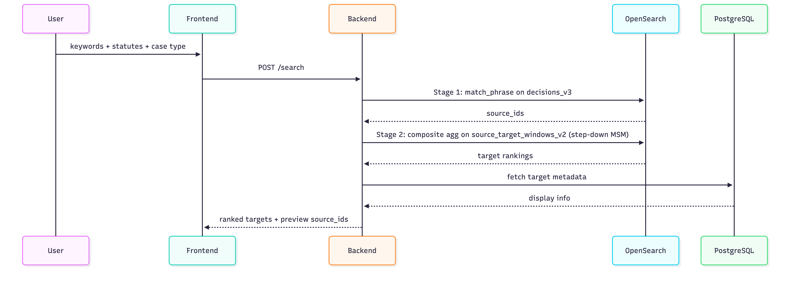

**できること:**
- `車禍`（交通事故）や `行車紀錄器`（ドライブレコーダー）などのキーワードで検索
- `刑法`（刑法）+ `284` のように条文条件を追加
- 事件類型、裁判所レベル、文書種別で絞り込み
- ある被引用判決が異なる引用元判決からどのような文脈で引用されているかを確認
- 引用元判決の原文をそのまま開く


### RAG 検索

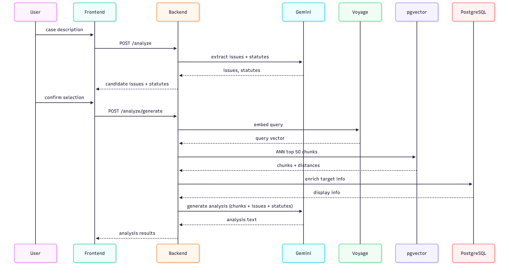

**できること:**
- 事案の事実関係を自然言語で入力
- Gemini に候補となる法律争点と条文を抽出させる
- 内容を確認したうえで、争点ごとの分析とそれを支える判決を得る


---

## このプロジェクトが解こうとしている問題

従来の法律検索には、主に二つの限界があります。

### 1. 位置情報を無視
全文検索は、キーワードが判決文に現れるかどうかは見ますが、それがどの文脈に現れるかまでは区別しません。

しかし、判決文では段落ごとに参考価値が異なります。たとえば、
- 裁判所自身の法的理由付け
- 当事者の一方の主張
- 手続の経過
- 事実関係の説明
- 証拠の記載

弁護士にとって、法的主張は裁判所に受け入れられる法的論述に基づいて組み立てる必要があります。したがって、同じキーワードにヒットしても、それが裁判所自身の法的理由付けに現れる場合は、事実関係や当事者の主張に現れる場合よりも、通常は参考価値が高くなります。

そのため Lawcidity は、裁判所が先行判決を引用する位置に特に注目します。裁判所は通常、法律上の争点を処理し、自らの法的理由付けを展開するときに先行判決を引用するからです。

### 2. 用語のずれ
同じ法的概念でも、表現が複数あります。たとえば、
- `詐欺`（詐欺） vs `詐騙`（だまし）
- `資遣`（整理解雇・レイオフ） vs `終止勞動契約`（労働契約の終了）

利用者が入力した語が、判決で一般に使われる表現と一致しない場合、従来のキーワード検索では実質的に関連する判決を取りこぼしやすくなります。

---

## なぜ「引用関係」でランキングするのか

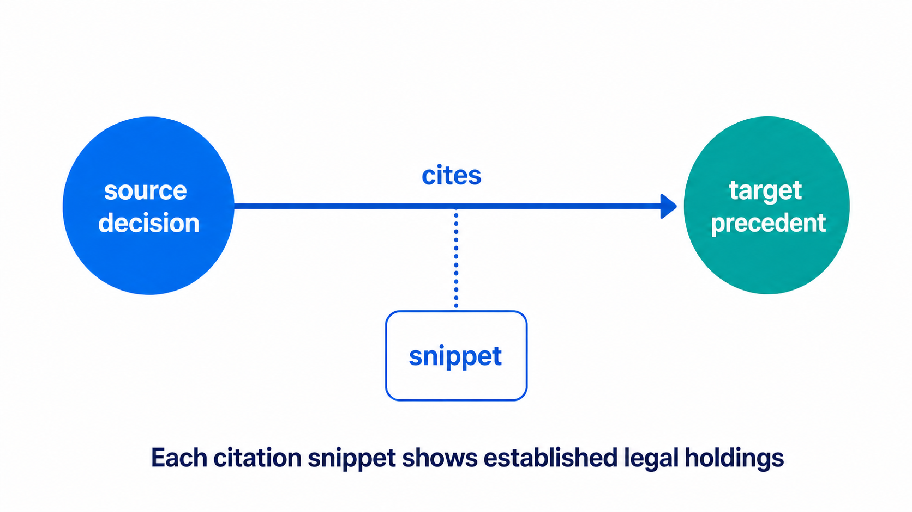

引用関係は次の図のとおりです。後に作成された判決が先行判決を引用し、その先行判決を引用するとき周辺に現れる文脈は、実務上比較的安定した法的見解をよく反映しています。

Lawcidity は、利用者の検索にヒットした判決を探すだけではなく、次のことを見ようとしています。

> この検索のもとで、どの先行判決が実際に裁判所から繰り返し引用され、後の裁判所がそれらをどのような法的見解として整理して使っているのか。

裁判所は判決理由を書くとき、よく以前の判決を引用します。まずはこの図を見てください：

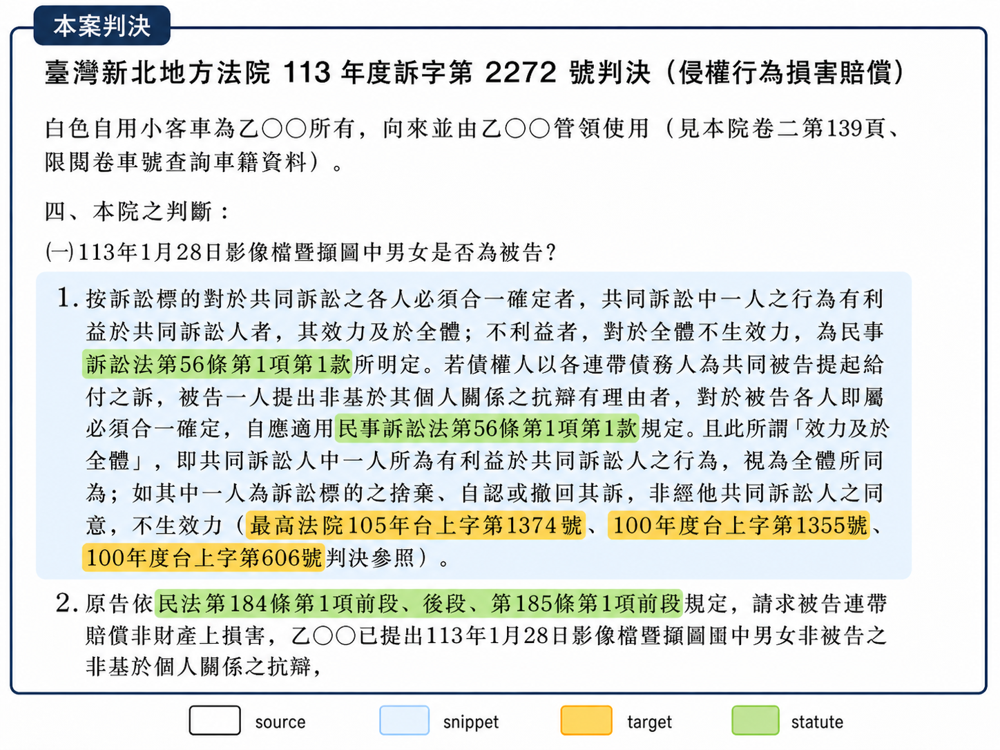

これは実際の判決をもとにしたイメージで、特に重要なのは次の 3 つです。

- いま理由を書いている上側の判決を `source` と呼びます。引用する側です
- オレンジ色で示した事件番号、たとえば「最高法院105年台上字第1374號」のような過去の判決を `target` と呼びます。引用される先行判決です
- 青い枠で囲った短い部分を `citation snippet` と呼びます。判決の中でも特に重要で、要点が詰まった断片です

この種の引用が重要なのは、その周辺の文脈からたいてい次の 3 つが見えてくるからです。

- 裁判所が今回の事件で中心だと考えている法律上の問題は何か
- 裁判所が、どの先行判決の法的見解を使う価値があると考えているか
- 裁判所が、その先行判決をどう引用して自分の論述を支えているか

だから弁護士にとっては、`target` と `citation snippet` のどちらも重要です。

- `target` は、その見解がどの先行判決に由来するかを教えてくれます
- `citation snippet` は、後の裁判所がその先行判決をどう法的見解としてまとめ、自分の論述をどう支えているかを見せてくれます

Lawcidity のランキングは、この構造を使って作っています。

システムは、検索にヒットした判決をただ全部混ぜるのではなく、まず検索条件に本当に合う `citation snippets` を見つけ、その断片が共通して指している `target` を見ます。異なる後の判決が、似た問題を扱う中で同じ先行判決に収束していくなら、その先行判決を上位に出すべきだと考えます。

言い換えると、結果一覧が先に答えるのは次の問いです。

> この検索のもとで、裁判実務はどの先行判決に最も収束しているのか。

そして結果を開いて見える `citation snippets` が答えるのは次の問いです。

> 後の裁判所は、これらの先行判決をどのような法的見解にまとめて使っているのか。

たとえば Lawcidity で `車禍`（交通事故）を検索し、1 位の結果を開くと、多くの後の判決が「突発状況」をどう定義するかを論じているのが分かります。別の先行判決の下では、「逃逸」の定義が繰り返し扱われています。

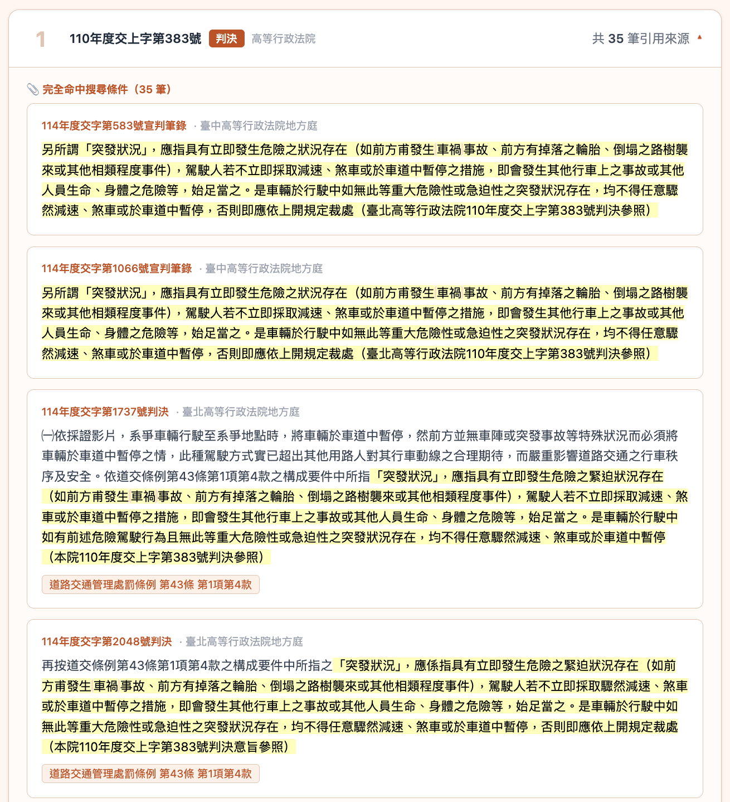

ここで見えてくるのは、どの結果が検索にヒットしたかだけではありません。裁判所が異なる問題のもとで、既存の見解をどう繰り返し整理し、使っているかです。

そのため、引用関係をたどることで、次の 2 つを同時に捉えられます。

- 一つの判決の中で最も重要で要点の詰まった断片
- この検索のもとで、異なる裁判所から繰り返し引用される先行判決

そして Lawcidity は、この 2 つの手がかりを一緒にランキングに使っています。

---

## Lawcidity のアプローチ

| モード | 仕組み | 解決すること |
|---|---|---|
| **キーワード検索** | 裁判所が先行判決を引用している断片の中でキーワードを照合し、関連度と引用回数にもとづいて先行判決を順位付けする | 単に「全文にキーワードがヒットした判決」を探すのではなく、「特定の法律争点のもとで裁判所が繰り返し引用する」重要な判決を見つける |
| **セマンティック検索（RAG）** | 「利用者の問題」と「引用付近の法的理由付け」を照合し、意味的に近い判決を見つける | 厳密なキーワード一致への依存を下げ、「言い方は違っても争点は同じ」裁判所の法的論述を見つける |

---

## このプロジェクトの特徴

- **140万件の公開判決データを扱っている。**  
  公開判決データを対象に、引用関係の抽出、誤検出の除去、OpenSearch のインデックス設計を行っています。

- **引用関係をランキングの仕組みの中核にしている。**  
  「同じキーワードを含む判決」を探すだけでなく、「裁判所が同じ争点で繰り返し引用する判決」を優先して上位に出します。

- **精度だけでなく速度も最適化している。**  
  キーワード検索は約 `73 秒` から `2-4 秒` に短縮され、再ランキング時も、キャッシュにヒットすれば `1 ms` 未満まで下がります。

---

## 用語とデータ単位

以下では、このプロジェクトで繰り返し出てくる中心的な用語とデータ単位を整理します。

| 用語 | 説明 |
|---|---|
| **decision** | 判決・裁定を含む裁判所の裁判文書。引用関係のグラフではノードとして扱う |
| **authority** | 司法院釈字や決議など、裁判ではない法的権威資料。これもノードとして扱う |
| **source** | 他の裁判や法的権威資料を引用する裁判 |
| **target** | 引用される裁判または法的権威資料 |
| **citation** | `source` が `target` を一度引用した記録 |
| **citation snippet** | 各 `citation` の周辺にある法的理由付けの断片で、`target` がどの文脈で引用されたかを示す |
| **statute** | 判決全文または citation snippet に現れる条文。たとえば民法第184条 |
| **chunk** | `citation` の位置を起点に切り出されたテキスト単位で、セマンティック検索の検索単位になる |
| **embedding** | `chunk` のベクトル表現で、意味的類似検索に用いる |

---

## 検索性能と最適化結果

| 操作 | 改善前 | 改善後 |
|---|---|---|
| キーワード検索（`詐欺` / fraud） | ~73s | 2-4s |
| 再ランキング | ~1.27s | ~0.04s（キャッシュヒット時は `<1 ms`） |
| 引用展開 | 13-16s | ~0.8-1.0s |

---

## アーキテクチャ

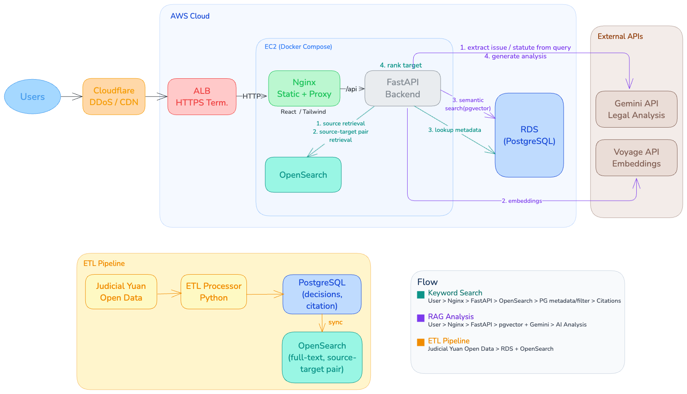

| 層 | 技術 |
|---|---|
| フロントエンド | React 19, Tailwind CSS 4 |
| バックエンド | FastAPI |
| キーワード検索 | OpenSearch（2-gram ngram analyzer） |
| セマンティック検索 | pgvector（ivfflat） |
| データベース | PostgreSQL |
| AI サービス | Gemini Flash, Voyage API（`voyage-law-2`） |
| デプロイ | AWS EC2, RDS, ALB, nginx |

---

## データソースとデータモデル

### データソース
[司法院オープンデータプラットフォーム](https://opendata.judicial.gov.tw/)  
2025 年 1 月から 2026 年 1 月までの公開裁判データを収録しています。

生データ JSON の例（ファイル名は元データのまま保持）:  
[data/PCDV,113,訴,2272,20250210,1.json](data/PCDV,113,訴,2272,20250210,1.json)

### データ規模

PostgreSQL: **17 GB**（RDS）  
OpenSearch: **3.2 GB**（EC2）

### ETL フロー

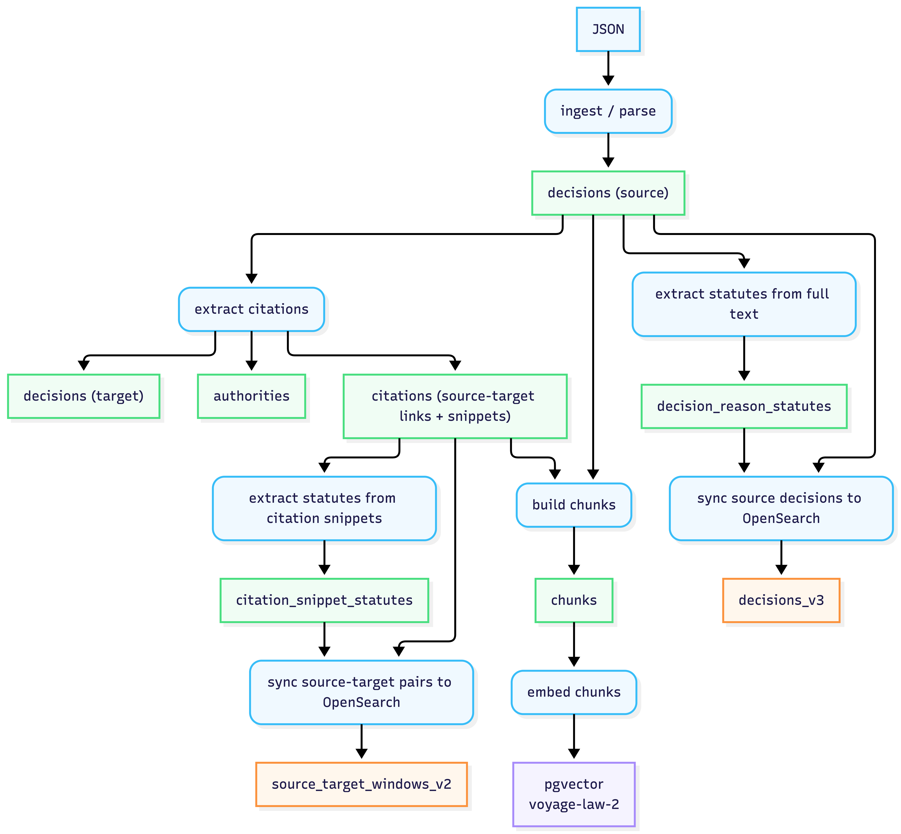

### PostgreSQL ER 図


### 主要テーブル

| テーブル | 件数 | 説明 |
|---|---|---|
| `decisions` | 1.4M | 正規化済みの裁判データ。`source` と `target` の両方を含む |
| `citations` | 552K | `source` から `target` への引用記録。citation snippets と全文中の位置情報を含む |
| `chunks` | 575K | `citation` 位置を起点に切り出したテキスト片。`embedding` を持ち、セマンティック検索に使用 |
| `decision_reason_statutes` | 6.6M | 判決全文から抽出した条文引用 |
| `citation_snippet_statutes` | 458K | citation snippets から抽出した条文引用 |
| `authorities` | 1.6K | 司法院釈字や決議など、裁判ではない法的権威資料 |

### OpenSearch インデックスと文書構造

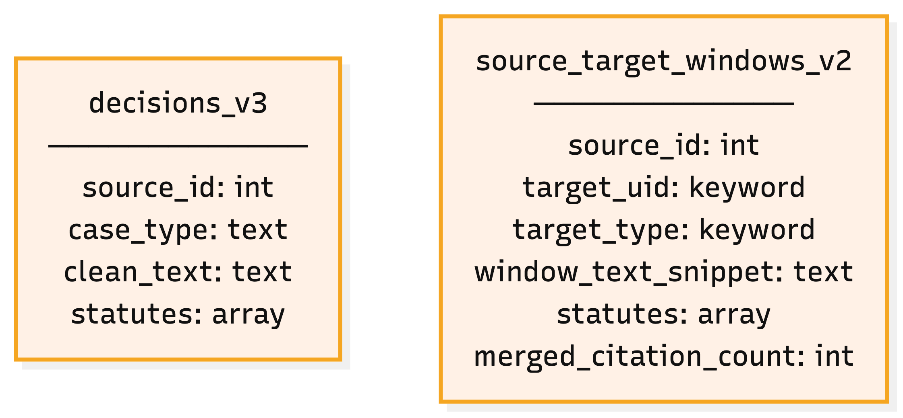

| インデックス | 文書数 | サイズ | 説明 |
|---|---:|---:|---|
| `decisions_v3` | 3.0M | 2.8 GB | 全文キーワード検索用のインデックス。まず条件に合う source IDs を取得するために使う |
| `source_target_windows_v2` | 997K | 456 MB | citation snippets を持つ source-target ペア文書。取得した source 群から関連度の高い citation snippets を見つけ、その先の target を取り出すために使う |

---

## 主要な技術判断

### 1. 引用解析

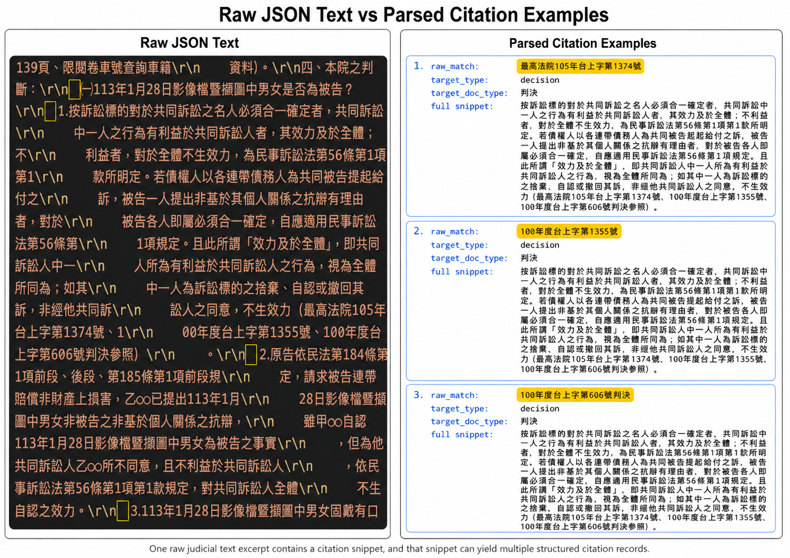

**クリーニングと解析**  
司法院が提供する裁判データは生の JSON で、全文の形式が一定せず、空白や非構造的な内容も混ざっています。そのままでは検索に使えません。

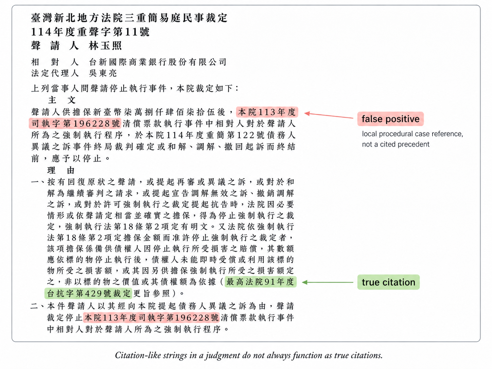

**難しい点**  
判決文に現れる案号は、必ずしも法的引用を意味しません。たとえば、
- 証拠への参照
- 手続の経過
- 過去事件の記録
- 当事者の主張の中に出てくる案号

などである可能性があります。

裁判所が自らの法的理由付けの中で、先行判決を論拠として引用している場合に限って、それを真の `citation` とみなすべきです。

たとえば、次の文字列はいずれも `citation` 候補として抽出され得ますが、真の法的引用とは限りません。

- `按最高法院 112 年度台上字第 1234 號判決意旨……`（「最高法院 112 年度台上字第 1234 號判決の趣旨によれば……」）
- `本件前經最高法院 112 年度台上字第 1234 號判決發回更審`（「本件は以前、最高法院 112 年度台上字第 1234 號判決により差戻しとなった」）
- `有臺灣高等法院 111 年度上字第 567 號裁定在卷可參`（「臺灣高等法院 111 年度上字第 567 號裁定が記録にあり参照できる」）

三つとも案号を含みますが、裁判所が既存の法的見解を援用しているのは最初の例だけで、後の二つは手続の経過や記録資料に触れているにすぎません。

**アプローチ**
- 前後文を見るルールを加えて絞り込む
- 抽出とフィルタのロジックを小さな関数に分け、それぞれを個別にテスト・調整できるようにする

大まかな流れは次のとおりです。

```text
1. 緩めの regex を使って、判決全文から案号候補を抽出する
2. 各候補の前後文と段落位置を調べる
3. その文脈に基づいて、手続の経過、証拠参照、当事者の主張など、真の引用ではない用法を除外する
4. 残ったものを `citation` とみなす
5. 有効と判定された `citation` の周囲から法的理由付けの `citation snippet` を切り出す
```

**結果**  
現在の pytest テストケースは、実データから取った 27 件以上のエッジケースをカバーしており、たとえば次のようなものがあります。
- 記録中の証拠物の除外
- 手続経過の検出
- 当事者主張の段落と裁判所自身の理由付け段落の区別

---

### 2. キーワード検索: 候補取得と順位付け

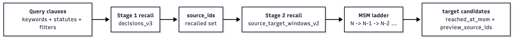

### なぜ二段階に分けるのか

初期のパイプラインはすべて PostgreSQL 上で処理していました。
1. 各判決の `clean_text` を `ILIKE` で走査して source を取得
2. 取得した source ごとに `citation snippets` を走査
3. 各 target の snippet ヒットスコアを計算
4. 合計スコアで target を並べる

この方法はデータ量が少ないうちは動きますが、`詐欺`（fraud）のようなヒット範囲の広いクエリでは、第一段階で非常に多くの source がヒットし、snippet 走査がボトルネックになります。

### Stage 1: source の取得

**アプローチ**  
まず、全文が検索条件に合う source IDs を取得します。

**なぜ PostgreSQL GIN ではないのか**  
同一データプールでのベンチマークでは、Stage 1 の全文召回にかかるクエリ遅延は次のとおりでした。
- `PG ILIKE / Seq Scan: 6.30s`
- `PG GIN(trgm): 0.266s`
- `OpenSearch: 0.205s`

**中国語テキストの検索戦略**  
OpenSearch でよく使われる IKトークナイザーは主に簡体字中国語向けです。一方、裁判文にはトークナイザーの辞書に載っていない専門的な法律語彙が大量に含まれ、分かち書きが安定しませんでした。

最終的に選んだのは、

**2-gram ngram + `match_phrase`**

です。つまり、
- 文書を重なり合う 2 文字単位に分割し
- `match_phrase` でそれらが順序どおり連続して現れることを要求する

ことで、キーワードが文書の離れた場所に散ってヒットしてしまうのを防ぎつつ、フレーズに近い精度を維持しています。

### Stage 2: target の収集

**アプローチ**  
Stage 1 で取得した source 群を対象に、それぞれの `citation snippets` を見て、検索条件にヒットしたものだけを残し、それらが共通して指している target を集計します。

**なぜこの段階も OpenSearch に移したのか**  
初期版では、Stage 1 が source IDs を返した後、PostgreSQL が source ごとに citation snippets を順番に走査していました。取得される source 数が数万件規模になると、ここでも性能が大きく悪化しました。

そこで `source_target_windows_v2` インデックスを用意しました。

- 各文書は 1 組の `(source, target)` ペアを表す
- そのペアに属する `citation snippets` と条文データをまとめて保持する
- `citation snippets` に対するキーワード条件や条文条件の照合を OpenSearch 内で処理できる

ようにしています。

PostgreSQL は最後のメタデータ取得と集計だけを担当します。

*MSM ladder: `minimum_should_match` を段階的に緩めながら候補を集める仕組み*

Stage 2 の target 収集では、step-down 形式の MSM ladder を使います。

MSM（`minimum_should_match`）は、ある source-target ペアが `citation snippets` の中で何個のクエリ句を満たせば条件に合致するとみなすかを制御します。

クエリ句には、
- `過失`（過失）や `車禍`（交通事故）のようなキーワード
- 刑法第 284 条や民法第 185 条のような条文条件

があります。

たとえばクエリ句が 3 個あるなら、システムは

1. MSM = 3
2. MSM = 2
3. MSM = 1

の順に試します。

最も厳しい MSM = N から始め、条件を徐々に緩めながら、候補プールが 200 個の target に達するまで集めます。

各 target には、最初にプールへ入った MSM レベルを `reached_at_msm` として記録します。

これはつまり、
- 最も高い MSM レベルで取得された target ほど、利用者の検索条件により正確に対応している可能性が高い
- より低い MSM レベルで初めて現れる target は、引用文脈との関連が相対的に弱い

ということです。

### target をどう順位付けするか

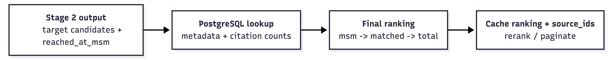

target の順位付けは、主に次の二つの手掛かりに基づきます。

1. **`reached_at_msm`**  
   より高い MSM レベルで最初に取得された target を優先する

2. **`matched_citation_count`**  
   同じ MSM レベル内では、異なる `source` のヒット断片がいくつ同じ `target` を共通して指しているかを見る

つまり Lawcidity が探しているのは、単に「全文中で検索キーワードや条文に触れている」判決ではなく、

> この検索のもとで、異なる裁判所のヒット断片がどの先行判決を繰り返し指しているのか

という点です。これは、位置情報を無視する全文検索よりも、弁護士が本当に知りたい答えに近いものです。

### 検索後の操作の待ち時間をどう下げたか

検索結果ページで利用者が行う操作は大きく二種類：
- 結果リスト上で **並び替え・ページ移動・絞り込み** を変える
- 一件の結果カードを **展開して引用元のスニペットを読む**

それぞれに対して、初回検索からなるべく重い処理を取り除く方向で最適化した。

**結果リスト操作のキャッシュ**  
最初の版では Stage 1 の source IDs しかキャッシュしていなかったため、
利用者が並び替え・ページ移動・絞り込み追加をするたびに Stage 2 を再実行する必要があった。
後の版では、最初の検索時点で target の順位付け全体をキャッシュし、
その後のリスト操作はメモリ上で処理できるようにした。

**引用展開の二段階ロード**  
カードを展開したときに見せるスニペットは、初回ロードと「もっと見る」の二段階で取り出す。

- **初回ロード**：OpenSearch が Stage 2 で返した `preview source IDs` をそのまま使い、
  PostgreSQL は source ごとに最も関連度の高い citation を 1 件だけ選んで判決情報を補う。
  これにより初回展開は約 `3 秒` から約 `0.8 秒` に短縮された。
- **「もっと見る」**：Stage 2 は target ごとに preview source ID を 5 件だけ確保する。
  該 target を引用する source がそれ以上いる場合、UI は「命中 N 件」と表示しつつ
  実際には 5 件のスニペットしか描画されない、という差分が出る。
  検索時に補完しきる案も検討したが、人気キーワード（例：損害、112k source）では
  追加クエリが約 `+3 秒` のコストになるため、UI 上で命中数 > 表示数のときだけ
  「もっと見る」ボタンを出し、クリック時に PostgreSQL 1 本のクエリで次の 5 件を返す形にした。
  追加コストは実際に展開された target だけに発生する。

**UIに表示する値の事前計算**  
事件番号や引用件数といった UI 表示用の値は ETL 段階で計算しておき、検索時に再計算しないようにした。

**インデックスのチューニング**  
`WHERE` / `JOIN` / `ORDER BY` でよく使うクエリの形に合わせて複合インデックスを張り直した。

---

### 3. RAG 検索: 検索と生成

### RAG の流れ
利用者はまず自然言語で法的問題を記述します。Gemini が候補となる法律争点と関連条文を抽出し、利用者が確認した後、残りの RAG パイプラインに進みます。

- **クエリ理解**  
  利用者の入力を明示的な法律争点と条文条件に整理し、後続の生成分析に渡す構造化入力にする

- **R — Retrieval（検索）**  
  利用者クエリを `embedding` に変換し、pgvector から意味的に近い、`citation` を起点に切り出した `chunks` を取得し、判決単位へ集約する

- **A — Augmentation（文脈補強）**  
  取得した `chunks`、`source` 判決のメタデータ、関連する `target` への参照をプロンプトにまとめ、後続の分析の文脈として使う

- **G — Generation（生成）**  
  Gemini が検索で得た実際の判決を根拠に、争点ごとの分析を生成する

### 検索
- Voyage API（`voyage-law-2`）でクエリを `embedding` に変換
- PostgreSQL / pgvector の IVFFlat インデックスで近似検索を実行
- 余弦類似度で最も近い上位 50 件の chunks を返す
- 判決単位に集約し、最も高得点の chunk をその判決の代表スコアとする

### Chunk 設計

各 `chunk` は全文を機械的に切るのではなく、判決中の `citation` 位置を基点に切り出します。これにより、`embedding` に送られるのは、裁判所が実質的な法的理由付けに入る箇所であり、情報量の多いテキストになります。

- **中心点**: 判決中の citation 位置
- **境界**: citation 位置から、最も近い構造マーカー `㈠㈡㈢`、`⒈⒉⒊`、`一二三` などまで広げる
- **長すぎる場合**: 範囲が 2,000 文字を超えるときは、`。` を文境界として切り直す
- **ハード制約**: 理由欄の見出しより前には伸ばさず、文末の日付行も越えない
- **重複処理**: 隣接する `citation` 由来の `chunks` が重なれば統合し、完全に同一なら MD5 で重複除去して冗長な `embedding` を避ける

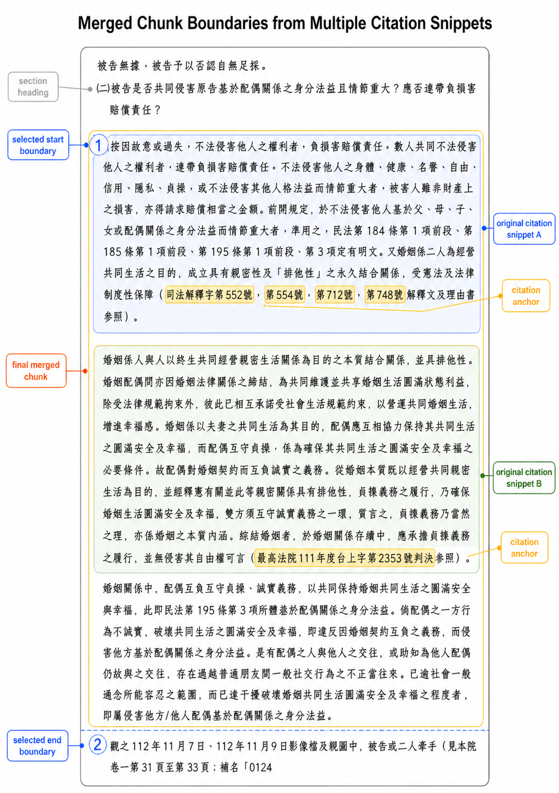

### Embedding モデルの選定

`embedding` モデルは 3 ラウンドにわたって評価し、次を比較しました。

- `BAAI bge-m3`
- `Qwen3-Embedding (0.6B / 4B)`
- `Gemini embedding`
- `voyage-multilingual-2`
- `voyage-law-2`
- `voyage-4-large`

各ラウンドでは同じ評価セットを使いました。
- 民事・刑事・行政・知財を含む 6 件の `target` 判決
- 各 `target` を実際に引用している `citation snippets` を正例として使用
- 無関係な snippets を 20 件、負例として追加

### 評価指標

- **`avg gap`**: 関連する抜粋の平均スコアから無関係な抜粋の平均スコアを引いた値。関連・無関係の分離をどれだけ安定して行えるかを見る
- **`Recall@5`**: 関連する抜粋が上位 5 件に入る割合。関連断片を上位に押し上げられるかを見る

| Model | avg gap | min gap | Recall@5 |
|---|---:|---:|---:|
| bge-m3 | 0.212 | 0.080 | 0.826 |
| Qwen3-Embedding-0.6B (512d) | 0.341 | 0.177 | 0.938 |
| voyage-multilingual-2 | 0.386 | 0.287 | 0.938 |
| voyage-4-large | 0.351 | 0.230 | 0.938 |
| **voyage-law-2** | **0.404** | **0.241** | 0.882 |

**最終選択: `voyage-law-2`**

主な理由は、**avg gap** が最も高く、関連する抜粋と無関係な抜粋を最も安定して分離できたためです。

- `Qwen3-Embedding-0.6B` と比べて avg gap は約 **18%** 高い
- `voyage-4-large` と比べても約 **15%** 高い

`Recall@5` は一部モデルよりやや低いものの、関連する抜粋と無関係な抜粋のスコア差をより明確に作れるため、無関係な断片が高得点結果に紛れ込みにくくなります。

---

## 開発の流れ

7 週間にわたるアジャイル開発で、司法院の生の JSON から出発し、実際に使える検索プロダクトへと段階的に仕上げました。

| フェーズ | 期間 | 主な作業 |
|---|---|---|
| **1. 解析と正規化** | 2 月 12-24 日 | 引用パーサ（状態機械）を作り、条文抽出と false positive 除去を実装し、schema を v1 から v4 へ更新 |
| **2. キーワード検索** | 2 月 25 日-3 月 3 日 | OpenSearch と PostgreSQL GIN を比較し、IKトークナイザーを 2-gram ngram に置き換え、`citation snippet` の一致度に応じて順位付けする仕組みを導入 |
| **3. API とフロントエンド** | 3 月 5-13 日 | REST API と SQL 集約処理、React の検索 UI とフィルタ UI を実装し、Docker + EC2 へのデプロイを完了 |
| **4. パーサ再設計** | 3 月 14-21 日 | 引用パーサを追跡可能でテストしやすい小さな関数群に再構成し、false positive 除去ルールを強化 |
| **5. セマンティック検索と RAG** | 3 月 22-27 日 | 埋め込み評価を複数回実施し、`citation` を起点にした `chunks` を設計し、pgvector による検索と Gemini を使った分析を統合 |
| **6. 最適化とデプロイ** | 3 月 26-30 日 | `chunks` の重複除去、本番 HTTPS デプロイ、基礎的な性能調整を実施 |
| **7. 検索・取得の最適化** | 4 月 7-19 日 | `source_target_windows_v2` を構築し、`minimum_should_match` を段階的に緩めながら候補を集める仕組みを導入し、キャッシュにより検索後の操作の待ち時間を削減 |

---

## 今後の課題

- `chunks` の境界設計を見直し、LLM 補助分割で事実記述・当事者主張・裁判所自身の法的理由付けというように、文脈でより明確に chunk を分ける
- 利用者クエリを法律実務で用いられる用語に書き換えることで、検索再現率と関連性が改善するかを検証する
- LLM 呼び出しに対して timeout・retry 制御を整備し、検索パイプライン全体の安定性を高める
- ログ収集や tracing を強化し、RAG の各段階でどこがボトルネックまたは失敗点なのかを追跡しやすくする
